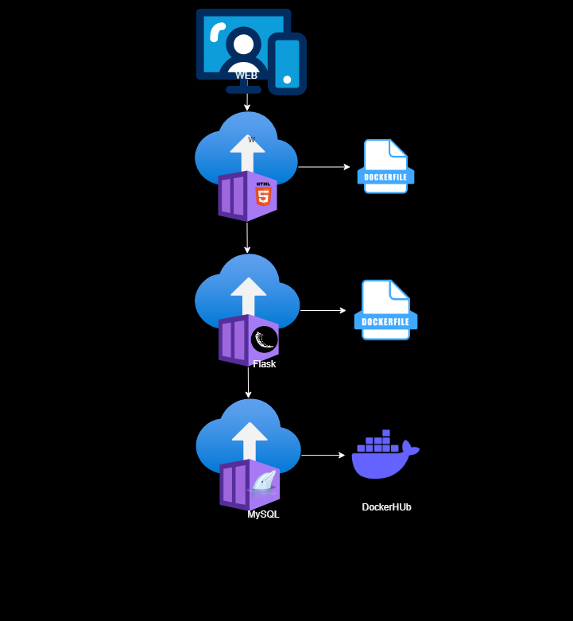

# CP3-Devops

Este repositório é um trabalho da matéria de Devops do curso de Análise e Desenvolvimento de Sistemas, na FIAP (Faculdade de Informática e Administração Paulista).

A proposta do trabalho grupo foi fazer uma página WEB de cadastro que irá fazer a persistência no banco de dados utilizando Docker.

### 🚀 Iniciar

Para inicialização do projeto, baixo o projeto como um arquivo .zip

Use o comando:

```
docker-compose up -d --build
```
E pronto, você pode acessar no seu navegador o *localhost* para testar

## 🛠️ Tecnologias utilizadas

- **React-Native** - Framework para aplicativos móveis com JavaScript e React.

- **Docker** - Plataforma para desenvolvimento, envio e execução de aplicativos em contêineres.

- **MySQL** - Sistema de gerenciamento de banco de dados relacional baseado em SQL.

- **Flask** - Micro framework web em Python para desenvolvimento rápido e simples de aplicativos web.

- **Python** - Linguagem de programação de alto nível, interpretada e de propósito geral.

- **HTML5** - Linguagem de marcação utilizada para estruturar e apresentar conteúdo na web.

- **JavaScript** - Linguagem de programação utilizada para desenvolvimento de páginas web interativas.

- **Bootstrap** - Framework front-end para desenvolvimento ágil e responsivo de interfaces web.

- **Nginx** - Servidor web e proxy reverso de alta performance, utilizado para balanceamento de carga e cache de conteúdo.

## ✒️ Autores
**2TDSPF**

- **Gustavo de Oliveira Azevedo** - [Linkedin](https://www.linkedin.com/in/gustavo-de-oliveira-azevedo/) | [Github](https://github.com/gutolive09)
- **Mateus Mantovani Araújo** - [Linkedin](https://www.linkedin.com/in/mateus-mantovani-araújo-937944286/?originalSubdomain=br) | [Github](https://github.com/Mmateus106)
- **Gabriel Siqueira Rogrigues** - [Linkedin](https://www.linkedin.com/in/gabrielrodri/) | [Github](https://github.com/gabrielrodri33)
- **Juan de Godoy** - [Linkedin](https://github.com/linkParaPerfil)

## Arquitetura

